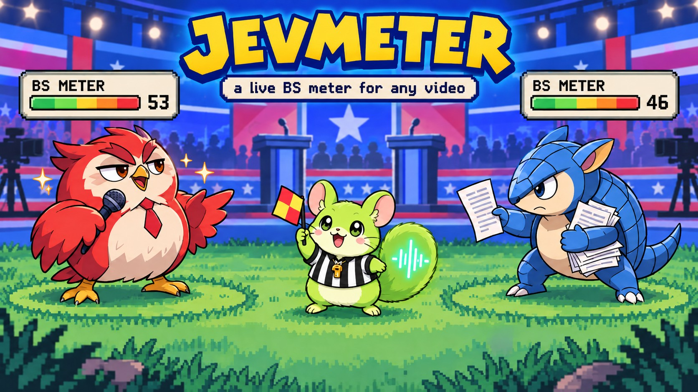
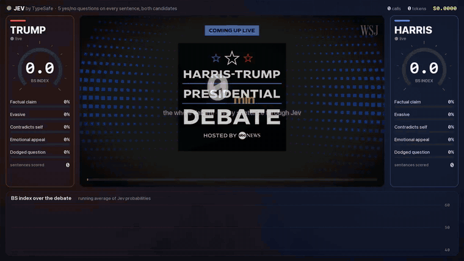
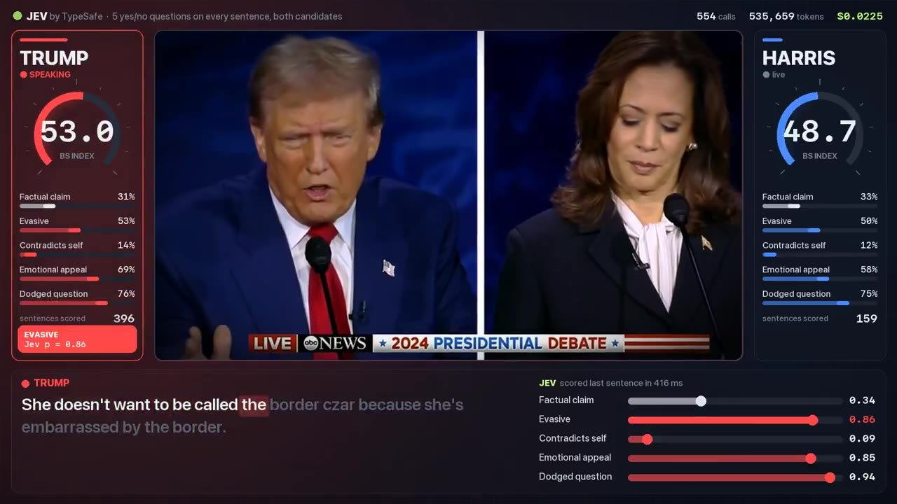
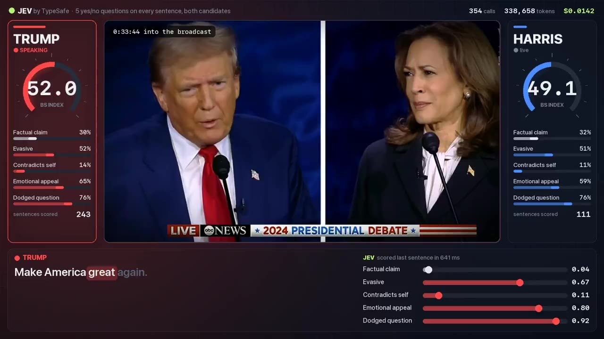
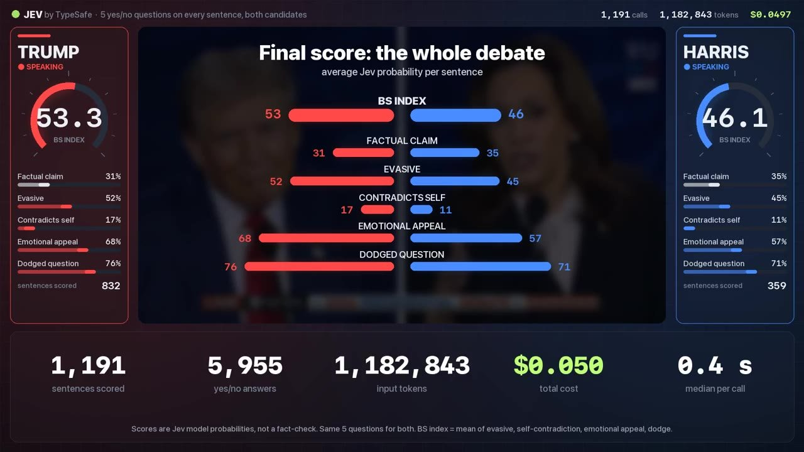
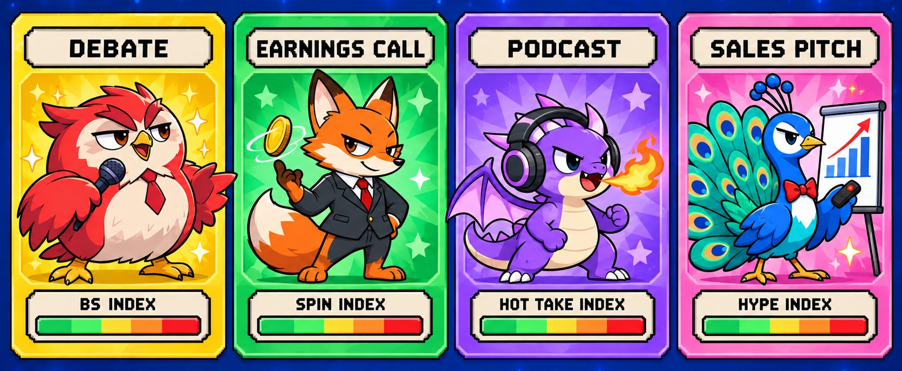
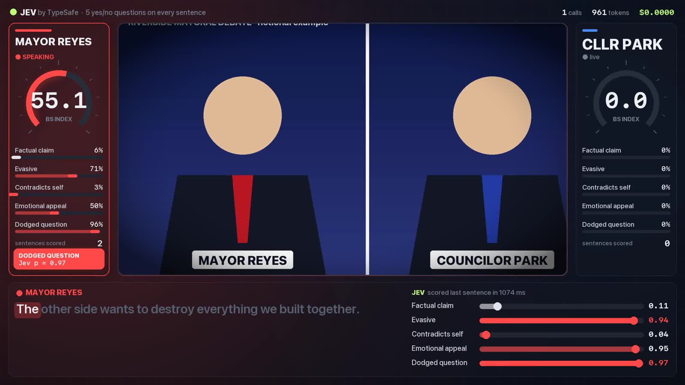
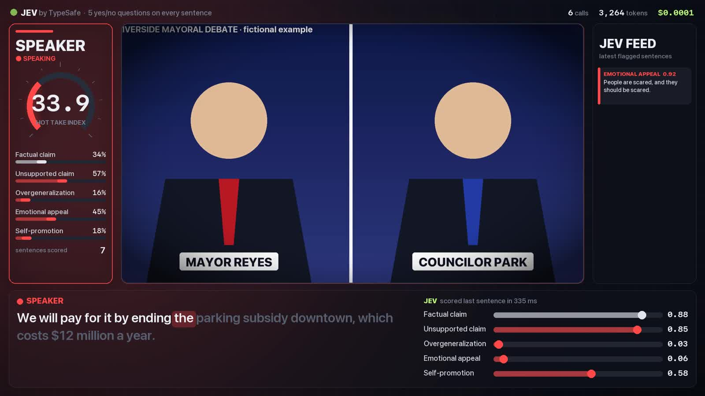

<p align="center">
  
</p>

<p align="center">
  <a href="https://x.com/chetaslua/status/2100473581251748216"></a>
  <a href="https://docs.typesafe.ai"></a>
  
  
</p>

<h3 align="center">Every sentence scored. Every dodge flagged. Rendered as a 16:9 edit you can post.</h3>

---

## ⚔️ The battle that started it

I gave the Trump vs Harris debate a live BS meter using **Jev**, [TypeSafe's](https://docs.typesafe.ai) decision model
that answers yes/no questions with calibrated probabilities instead of writing text.
**[Watch the full video on X →](https://x.com/chetaslua/status/2100473581251748216)**

https://github.com/user-attachments/assets/34b071ea-d13c-4cd5-b4b1-4f28ff7df3c2

<p align="center">
  <a href="https://x.com/chetaslua/status/2100473581251748216"></a>
  <a href="https://x.com/chetaslua/status/2100473581251748216"></a>
</p>

<table>
<tr>
<td width="33%"></td>
<td width="33%"></td>
<td width="33%"></td>
</tr>
<tr>
<td align="center"><b>Flag!</b> <i>Evasive, Jev p = 0.86</i></td>
<td align="center"><b>Camera follows the speaker</b></td>
<td align="center"><b>Final scoreboard + receipts</b></td>
</tr>
</table>

### 📊 Battle stats (measured, not estimated)

| | 🔴 Trump | 🔵 Harris |
|:--|:--:|:--:|
| **BS INDEX** | **53** | **46** |
| Factual claim | 31 | 35 |
| Evasive | 52 | 45 |
| Contradicts self | 17 | 11 |
| Emotional appeal | 68 | 57 |
| Dodged question | 76 | 71 |
| Sentences scored | 832 | 359 |

<p align="center">
  <b>1,191</b> Jev calls · <b>5,955</b> yes/no answers · <b>1,182,843</b> input tokens · <b>$0.0497</b> total · <b>~0.4 s</b> median per call
</p>

> The meters show Jev's **probabilities**, not a fact-check. Both speakers get the same 5 questions, and the highlight
> clips are picked by one fixed rule. See [Read the numbers responsibly](#-read-the-numbers-responsibly).

---

## 🎴 Choose your preset

<p align="center">
  
</p>

| preset | index | questions Jev asks about every sentence |
|---|---|---|
| `debate` | **BS INDEX** | factual claim · evasive · contradicts self · emotional appeal · dodged question |
| `earnings_call` | **SPIN INDEX** | specific number · vague guidance · blames outside factors · hype language · dodged question |
| `podcast` | **HOT TAKE INDEX** | factual claim · unsupported claim · overgeneralization · emotional appeal · self-promotion |
| `sales_pitch` | **HYPE INDEX** | concrete metric · buzzwords · overpromise · urgency pressure · vague benefit |

Want a different fight? A preset is a small JSON file, so [write your own](#-custom-questions).

---

## 🚀 Quick start

```bash
git clone https://github.com/ChetasLua/jevmeter.git
cd jevmeter
pip install -e ".[mlx]"      # Apple Silicon (mlx-whisper)
# pip install -e ".[cpu]"    # everything else (faster-whisper)

export TYPESAFE_API_KEY=...  # https://console.typesafe.ai/keys
```

**Two speakers + transcript** (debates, interviews):

```bash
jevmeter run debate.mp4 --transcript debate.txt \
  --speakers "TRUMP,HARRIS" --label TRUMP=Trump --label HARRIS=Harris --preset debate
```

**One speaker, no transcript** (podcasts, pitches, keynotes):

```bash
jevmeter run pitch.mp4 --preset sales_pitch --speakers "Founder" --mode full --start 60 --end 180
```

**Try it without any footage**: a fictional mock debate made with macOS text-to-speech.

```bash
python examples/make_mock_video.py
jevmeter run examples/mock_debate.mp4 --transcript examples/mock_debate_transcript.txt \
  --speakers REYES,PARK --label REYES="MAYOR REYES" --label PARK="CLLR PARK" --clips 2
```

That run scores 33 sentences for about **$0.001** and renders a 74 s video in under 3 minutes on an M-series Mac.
Jev rated the evasive mayor at **62.9** and the specific councillor at **20.0**.

<table>
<tr>
<td width="50%"></td>
<td width="50%"></td>
</tr>
<tr>
<td align="center"><b>Two-speaker mode</b></td>
<td align="center"><b>Single-speaker mode + live Jev feed</b></td>
</tr>
</table>

---

## ✨ What's in the box

| | |
|---|---|
| 🎙️ **Transcribe** | mlx-whisper or faster-whisper word timestamps; an optional `NAME: text` transcript is aligned to the audio |
| ⚡ **Score** | one Jev request per sentence, with the speaker's history and the last question as context |
| 🎬 **Two edit modes** | `highlights` auto-picks clips + hyperlapse + end card; `full` puts the meter over the whole range |
| 📷 **Camera** | eases toward whoever is speaking on a broadcast split screen, zoom kick when a flag fires |
| 🟢 **Jev effects** | scan beam when a sentence is scored, data dot flying into the meter, glowing flag cards |
| 🔊 **Sound** | original audio + synthesized whooshes, blips and riser, loudness-normalised for social |
| 💾 **Resumable** | every step is cached; a crash or a tweak never re-pays for transcription or scoring |

---

## 📜 Transcript format

A line starting with `NAME:` begins a turn; other non-empty lines continue it.

```text
MODERATOR: Housing costs rose eleven percent last year. What will you do about it?
REYES: Look, everybody knows this city is the greatest city in the country.
PARK: We will permit four thousand new homes near transit by 2028.
```

Names and spelling come from your transcript, timing comes from the audio. Speakers you don't pass to `--speakers`
aren't scored, but their latest turn is given to Jev as context; that's how "dodged question" knows what was asked.
A transcript that repeats itself verbatim, as some news pages do, is de-duplicated automatically. Without a
transcript, all speech counts as one speaker.

## 🧪 Custom questions

```json
{
  "hook": "I gave this keynote a live hype meter.",
  "hook_sub": "every sentence · 2 questions each",
  "index_label": "HYPE INDEX",
  "context_label": "question",
  "end_title": "Final score: the whole keynote",
  "questions": [
    {"key": "benchmark", "label": "Cites a benchmark", "index": false,
     "instructions": "Does this sentence cite a specific benchmark result or number?"},
    {"key": "superlative", "label": "Superlative", "index": true,
     "instructions": "Does this sentence use superlatives (best ever, most powerful) without evidence?"}
  ]
}
```

Run it with `--preset my_questions.json`.

- `index: true` questions are averaged into the big gauge.
- `index: false` questions (like "factual claim") are shown in neutral grey.
- `flag` (0–1) sets the pop-up threshold. By default it's the 98th percentile of that question's scores, with a floor of 0.5.
- Up to 6 questions fit the layout.

## 🎮 All the options

| option | default | what it does |
|---|---|---|
| `--mode highlights\|full` | `highlights` | auto-edited highlights, or the meter over the whole range |
| `--clips N` | 3 | clips per speaker in highlights mode |
| `--start / --end` | whole video | seconds; limits transcription, scoring and rendering |
| `--hook "text"` | from preset | opening headline; `--hook ""` turns it off |
| `--label KEY=Name` | speaker key | display name per speaker (repeatable) |
| `--colors "#hex,#hex"` | red, blue | speaker colours |
| `--whisper-model` | `small` | any mlx-community / faster-whisper model name |
| `--threads` | 6 | parallel Jev requests |
| `--workers` | half your cores, max 4 | parallel render processes |
| `--price` | 0.042 | $ per 1M input tokens for the cost counter; check your console |
| `--score-only` | off | stop after scoring and print the per-speaker summary |
| `--work DIR` | `<video>.jevmeter/` | cache folder (words, sentences, scores, EDL, parts) |

## ⚙️ How it works

1. **Transcribe**: Whisper word timestamps. With a transcript, `difflib` aligns transcript words to Whisper's, so every
   sentence gets start/end times and per-word timings for the karaoke captions.
2. **Score**: `POST /v1/systemone` once per sentence, with each preset question as a `noul`. The state holds the
   speaker, the latest context turn, their previous 25 sentences and the answer so far. Keep-alive connections matter
   here: a fresh TLS handshake per call was about 15x slower. Results stream into `scores.jsonl`, so a crash resumes.
3. **Plan**: per-speaker averages, flag thresholds and an editable `edl.json`.
4. **Render**: Pillow draws every 1920×1080 frame into ffmpeg, in parallel slices that are then concatenated. The
   soundtrack is the original audio plus synthesized effects through `loudnorm`.

Hand-edit `edl.json` and re-render with `python -m jevmeter.render <work> out.mp4 0 <num_segments>`.

## 🧭 Read the numbers responsibly

- Jev returns **model probabilities**, not verdicts. "Evasive 0.86" is Jev's judgement of one sentence in context,
  not a fact-check. The end card says so, and your post should too.
- Sentence-level questions like "dodged question" run high for everyone, because one sentence rarely answers a whole
  question. Compare speakers with each other, not with zero.
- Highlights are chosen by one rule for every speaker (the highest average index over a 10–15 s stretch). Don't swap in
  hand-picked clips for one side only.
- You're responsible for having the rights to the footage you process.

## 📄 License

MIT © Chetas Lua. Not affiliated with TypeSafe; "Jev" is TypeSafe's model. The creature artwork is original and was
generated with ChatGPT for this project. The demo clips come from the ABC News debate broadcast and are shown here as
commentary on the tool's output.
