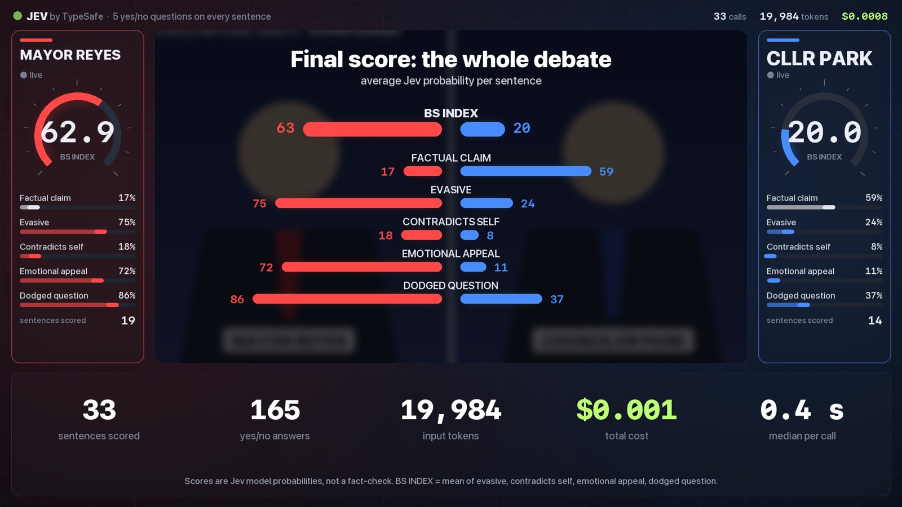

# jevmeter

Put a live **Jev** meter on any video. Every sentence gets scored by [TypeSafe's Jev](https://docs.typesafe.ai) (a "System One"
decision model that returns calibrated yes/no probabilities instead of text), and the result is rendered as a 16:9 edit:
meters for each speaker, karaoke captions, per-sentence score bars, flag pop-ups, a hyperlapse of the whole video and a
final scoreboard with receipts (calls, tokens, cost, latency).

This started as a one-off "live BS meter" on a presidential debate: 1,191 sentences, 5 questions each, **$0.05 in total
and ~0.4 s per call**. This repo is the reusable version. Bring any video and your own API key.


<table><tr>
<td></td>
<td></td>
</tr></table>

*Screenshots use the fictional mock debate in [`examples/`](examples/), generated with macOS text-to-speech.*

## What you get

- **Two-speaker mode** (debates, interviews): left and right meter panels, a camera that eases toward whoever is talking on
  a broadcast split screen, and ambient colour for the active side.
- **Single-speaker mode** (podcasts, speeches, pitches): one meter panel plus a live "Jev feed" of flagged sentences.
- **`highlights` mode**: picks the strongest 10–15 s stretches with one rule applied equally to every speaker, then adds a
  hyperlapse with a race chart and an end card. **`full` mode** puts the meter over the whole video, or over `--start`/`--end`.
- **Presets** for debates, earnings calls, podcasts and sales pitches, or write your own questions in JSON.
- A synthesized soundtrack (whooshes, blips, riser) under the original audio, loudness-normalised for social upload.
- Every step is cached in a work folder. Re-running after a crash or a tweak skips transcription and scoring.

## Install

Needs Python 3.9+. ffmpeg comes bundled through `imageio-ffmpeg`; a system ffmpeg is used if present.

```bash
git clone https://github.com/ChetasLua/jevmeter.git
cd jevmeter
pip install -e ".[mlx]"      # Apple Silicon (mlx-whisper)
# or
pip install -e ".[cpu]"      # everything else (faster-whisper)
```

Create an API key at [console.typesafe.ai/keys](https://console.typesafe.ai/keys) and export it. The key is only read
from the environment and never written to disk.

```bash
export TYPESAFE_API_KEY=...
```

## Quick start

**A debate or interview with a transcript** (recommended for two speakers):

```bash
jevmeter run debate.mp4 \
  --transcript debate.txt \
  --speakers "TRUMP,HARRIS" \
  --label TRUMP=Trump --label HARRIS=Harris \
  --preset debate
```

**A single speaker, no transcript needed**:

```bash
jevmeter run pitch.mp4 --preset sales_pitch --speakers "Founder" --mode full --start 60 --end 180
```

**Try it on the bundled fictional example** (macOS, uses `say`):

```bash
python examples/make_mock_video.py
jevmeter run examples/mock_debate.mp4 --transcript examples/mock_debate_transcript.txt \
  --speakers REYES,PARK --label REYES="MAYOR REYES" --label PARK="CLLR PARK" --clips 2
```

That run scores 33 sentences for about $0.001 and renders a 74 s video in under 3 minutes on an M-series Mac.

Output lands next to the video as `<name>.jevmeter.mp4`. Use `--score-only` to skip rendering and just print the per-speaker summary.

## Transcript format

Plain text. A line starting with `NAME:` begins a turn, and other non-empty lines continue the previous turn.

```text
MODERATOR: Housing costs rose eleven percent last year. What will you do about it?
REYES: Look, everybody knows this city is the greatest city in the country.
PARK: We will permit four thousand new homes near transit by 2028.
```

The transcript text is treated as authoritative. Whisper's word timestamps are aligned to it, so names, spelling and
speaker labels come from your transcript while timing comes from the audio. Speakers you don't pass to `--speakers`
(moderators, hosts) are not scored. Their latest turn is given to Jev as context, which is how "dodged the question"
knows what the question was. A transcript that repeats itself verbatim, as some news pages do, is de-duplicated
automatically.

Without `--transcript`, Whisper's text is used and all speech is attributed to one speaker.

## Presets and custom questions

| preset | index | questions |
|---|---|---|
| `debate` | BS INDEX | factual claim · evasive · contradicts self · emotional appeal · dodged question |
| `earnings_call` | SPIN INDEX | specific number · vague guidance · blames outside factors · hype language · dodged question |
| `podcast` | HOT TAKE INDEX | factual claim · unsupported claim · overgeneralization · emotional appeal · self-promotion |
| `sales_pitch` | HYPE INDEX | concrete metric · buzzwords · overpromise · urgency pressure · vague benefit |

A preset is a JSON file, so pass your own with `--preset my_questions.json`:

```json
{
  "hook": "I gave this keynote a live hype meter.",
  "hook_sub": "every sentence · 4 questions each",
  "index_label": "HYPE INDEX",
  "context_label": "question",
  "end_title": "Final score: the whole keynote",
  "questions": [
    {"key": "benchmark", "label": "Cites a benchmark", "index": false,
     "instructions": "Does this sentence cite a specific benchmark result or number?"},
    {"key": "superlative", "label": "Superlative", "index": true,
     "instructions": "Does this sentence use superlatives (best ever, most powerful) without evidence?"}
  ]
}
```

- `index: true` questions are averaged into the big gauge. `index: false` questions (like "factual claim") are shown in neutral grey.
- `flag` (optional, 0–1) sets the pop-up threshold. By default it's the 98th percentile of that question's scores, with a floor of 0.5.
- Up to 6 questions fit the layout comfortably.

## Useful options

| option | default | what it does |
|---|---|---|
| `--mode highlights\|full` | `highlights` | auto-edited highlights, or the meter over the whole range |
| `--clips N` | 3 | clips per speaker in highlights mode |
| `--start / --end` | whole video | seconds; limits transcription, scoring and rendering |
| `--hook "text"` | from preset | opening headline; `--hook ""` disables it |
| `--label KEY=Name` | speaker key | display name per speaker (repeatable) |
| `--colors "#hex,#hex"` | red, blue | speaker colours |
| `--whisper-model` | `small` | any mlx-community / faster-whisper model name |
| `--threads` | 6 | parallel Jev requests |
| `--workers` | half your cores, max 4 | parallel render processes |
| `--price` | 0.042 | $ per 1M input tokens for the cost counter; check your console for current pricing |
| `--work DIR` | `<video>.jevmeter/` | cache folder (whisper words, sentences, scores, EDL, parts) |

## How it works

1. **Transcribe**: mlx-whisper or faster-whisper produces word timestamps. With a transcript, `difflib` aligns
   transcript words to Whisper words, and each sentence gets start/end times plus per-word timings for the captions.
2. **Score**: one `POST /v1/systemone` request per sentence with every preset question as a `noul`. The state includes the
   speaker, the latest context turn, the speaker's previous 25 sentences and the answer so far. Requests reuse keep-alive
   connections; a fresh TLS handshake per call was about 15x slower in testing. Results stream into `scores.jsonl`, so a
   crash resumes where it stopped.
3. **Plan**: per-speaker averages, flag thresholds and an edit decision list (`edl.json`).
4. **Render**: Pillow draws every 1920×1080 frame and pipes it to ffmpeg. Slices render in parallel and are concatenated.
   The audio is the original track plus synthesized effects, run through `loudnorm`.

All intermediate files are plain JSON, so you can hand-edit `edl.json` and re-render with
`python -m jevmeter.render <work> out.mp4 0 <num_segments>`.

## Read the numbers responsibly

- Jev returns **model probabilities**, not verdicts. "Evasive 0.86" is Jev's judgement of one sentence in its context,
  not a fact-check. The end card says so, and you should say so too when you post.
- Sentence-level questions like "dodged the question" run high for everyone, because a single sentence rarely answers a
  whole question. Compare speakers against each other, not against zero.
- Highlight clips are chosen by one rule applied to every speaker: the highest average index over a 10–15 s stretch.
  That's what keeps the edit from being cherry-picked. Don't swap in hand-picked clips for one side only.
- You are responsible for having the right to use the footage you process.

## License

MIT. Not affiliated with TypeSafe; "Jev" is TypeSafe's model.
